# javascript-manipulacion-de-arrays

# 📒 V2 - forEach

El forEach() método ejecuta una función proporcionada una vez para cada elemento de la matriz.

```
    const array1 = ['a', 'b', 'c'];

    array1.forEach(element => console.log(element));

    // expected output: "a"
    // expected output: "b"
    // expected output: "c"
```

## Sintaxis 📒

```
    // Arrow function
    forEach((element) => { /* ... */ })
    forEach((element, index) => { /* ... */ })
    forEach((element, index, array) => { /* ... */ })

    // Callback function
    forEach(callbackFn)
    forEach(callbackFn, thisArg)

    // Inline callback function
    forEach(function(element) { /* ... */ })
    forEach(function(element, index) { /* ... */ })
    forEach(function(element, index, array){ /* ... */ })
    forEach(function(element, index, array) { /* ... */ }, thisArg)

```

# 📒 V3 - Mutable e Inmutable

En JavaScript, solo los objetos (objects) y las matrices (arrays) son mutables, no los valores primitivos.

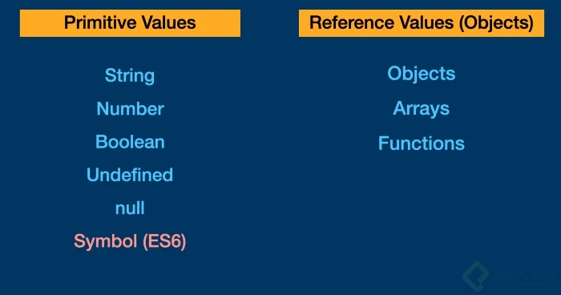

Los primitivos se pasan por valor y los objetos por referencias:

Ejemplo gráfico:


+ Mutable es un tipo de variable que se puede cambiar. Puedes hacer que el nombre de una variable apunte a un nuevo valor, pero el valor anterior todavía se mantiene en la memoria. De ahí la necesidad de la recolección de basura.
    + Un objeto mutable es un objeto cuyo estado puede modificarse después de su creación.
    + Los inmutables son los objetos cuyo estado no se puede cambiar una vez creado el objeto.
    + Las cadenas y los números son inmutables. Entendamos esto con un ejemplo:

En el código siguiente, se crea un nuevo objeto con valor de cadena.

```
    let immutableString = “Hola”;
    immutableString = immutableString + “Mundo”;
```

Al agregar “immutableString” con un valor de cadena, ocurren los siguientes eventos:

```
    - Se recupera el valor existente de "immutableString"
    - "Mundo" se agrega al valor existente de "immutableString"
    - El valor resultante luego se asigna a un nuevo bloque de memoria
    - El objeto "immutableString" ahora apunta al espacio de memoria recién creado
    - El espacio de memoria creado anteriormente ahora está disponible para la recolección de basura.
```

## Estructuras de datos inmutables

¿Estás seguro de que modificar esa variable no le hará daño al código? ¿No? Bueno, entonces aprendamos de inmutabilidad.

Si sabemos que algo es mutable cuando puede cambiar podemos deducir es inmutable cuando no puede cambiar. Ahora bien, para entender de que nos sirve la inmutabilidad veamos el siguiente ejemplo.

Imaginemos que estamos trabajando en equipo y tenemos un set de datos como este:


Pero resulta que queremos cambiar la vaca por un pez, así que hacemos algo así:


Sin embargo, El trabajo de nuestro compañero dependía de que la vaca estuviese ahí ¿Entonces que hacemos? Trabajar con datos inmutables.

Ya que nuestros datos son inmutables si queremos realizar cambios lo más sencillo sería hacer una copia modificada. Algo así:

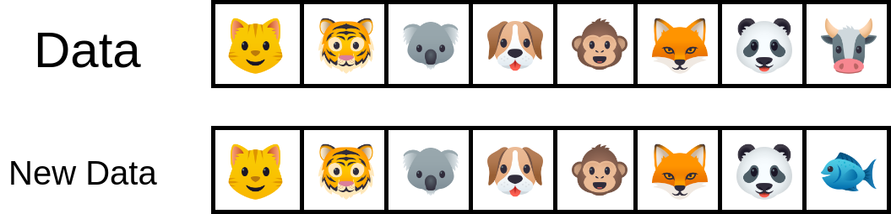

Por la cantidad de recursos que consume y dificultad para manejar múltiples copias, esta solución es lenta y poco escalable. Aquí entran las estructuras de datos persistentes

Las estructuras de datos persistentes son esencialmente estructuras de datos inmutables que pueden volver en el tiempo. Para entenderlas tenemos que pasar a verlas en forma de árbol. Algo así:

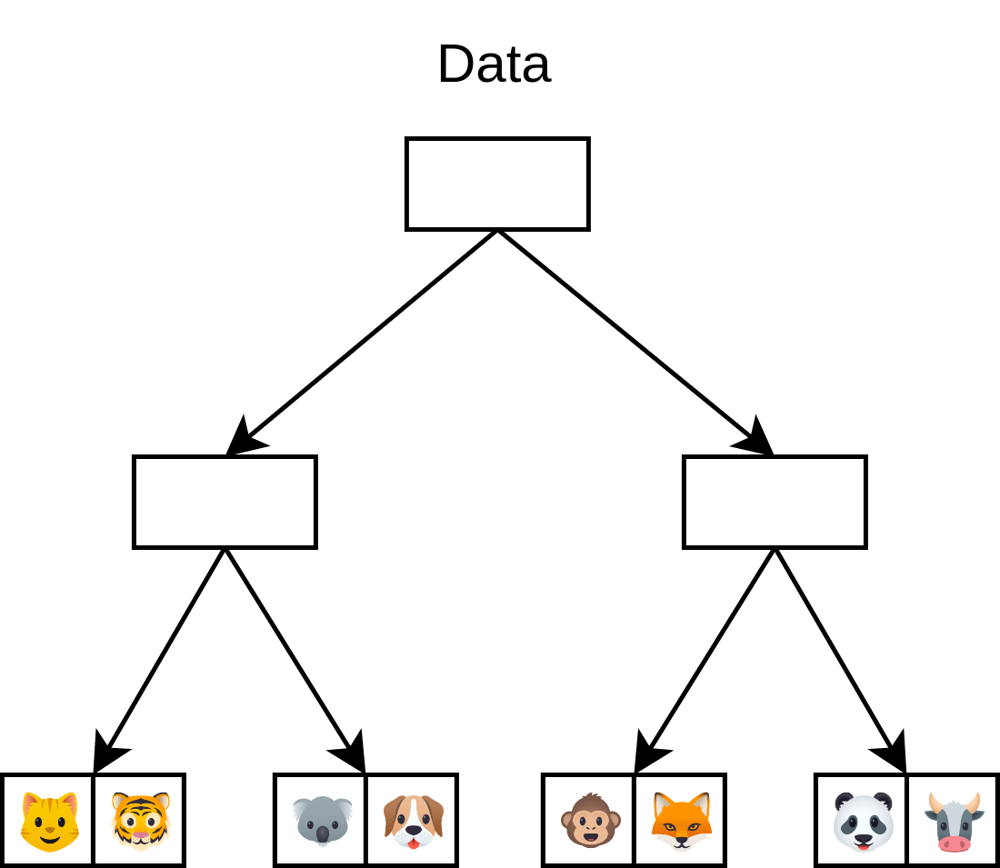

Aquí dividimos el set de datos en pares y los conectamos con nodos los cuales se conectan entre sí hasta llegar a un nodo raíz que identificará nuestro set de datos

Ahora, para realizar cambios a nuestros datos, enlazamos los nodos que no cambiaron en nuestro set de datos a un nuevo nodo raíz que identificará al nuevo set de datos. Algo así:


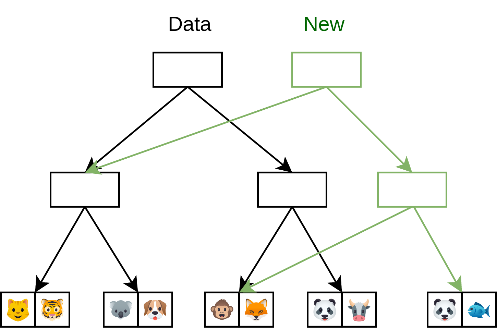

Esta técnica se llama **Path Copying** y nos permite que el modificar nuestro set de datos inmutable ocupe un menor espacio y sea mucho más rápido que copiarlo todo por cada cambio que realizamos. Con esta técnica también podremos acceder a nuestros datos originales en cualquier momento.

Ahora, para acceder a nuestros datos hagamos como que cada nodo es un bit y cada valor en ese bit representa un camino para llegar a nuestros datos. Algo como esto:

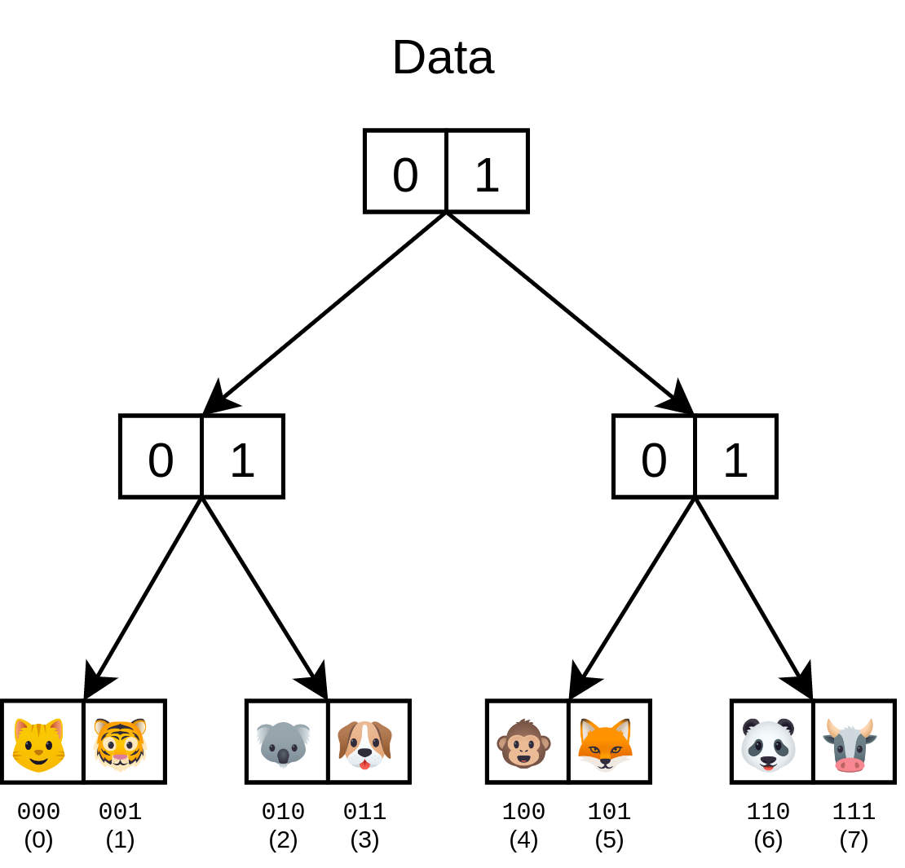

+ Entonces si quisiéramos llegar a nuestro panda en vez de escribir: Data[6] 
+ Tendremos que convertir nuestro 6 a binario y acceder de la siguiente forma: Data[0b110] 
+ (“0b” es solo un prefijo utilizado para indicar que es un número binario en vez de un número en base 10). Pero generalmente estos árboles no contienen nodos con solo dos ramas si no de 32 ramas por nivel, representando así 5 bits por nivel. Entonces si tuviéramos un número más grande como: 22693
+ Que para acceder al mismo con un número binario sería algo así: Data[0b101100010100101]
+ Con una estructura de 32 ramas sería algo así: Data10110--> 00101--> 00101

Así descendemos 3 niveles en lugar de 15.
Hay que tener en cuenta también que este es solo un ejemplo de estructuras de datos inmutables, pero sirve para tener una vista previa de como trabajan las mismas.
Ahora, si quieres aplicar esto en tus proyectos hay librerías de Javascript como Mori o Immutable que nos permiten trabajar con inmutabilidad en nuestros datos de manera muy sencilla.

# 📒 V4 - MAP

+ El map() método crea una nueva matriz con los resultados de llamar a una función proporcionada en cada elemento de la matriz que llama.
    + .map() es INMUTABLE por lo tanto no modifica el array original, sino que crea uno nuevo con la “transformación” aplicada.
    + Además, mantienes el mismo length que el array original, te devuelve en el nuevo array la misma cantidad que el array que le aplicaste el método.

```
    const array1 = [1, 4, 9, 16];

    // pass a function to map
    const map1 = array1.map(x => x * 2);

    console.log(map1);
    // expected output: Array [2, 8, 18, 32]

```

## Sintaxis

 ```
    // Arrow function
    map((element) => { /* ... */ })
    map((element, index) => { /* ... */ })
    map((element, index, array) => { /* ... */ })

    // Callback function
    map(callbackFn)
    map(callbackFn, thisArg)

    // Inline callback function
    map(function(element) { /* ... */ })
    map(function(element, index) { /* ... */ })
    map(function(element, index, array){ /* ... */ })
    map(function(element, index, array) { /* ... */ }, thisArg)
 ```

 El método join() une todos los elementos de una matriz (o un objeto similar a una matriz) en una cadena y devuelve esta cadena.

 ```
    const elements = ['Fire', 'Air', 'Water'];

    console.log(elements.join());
    // expected "Fire,Air,Water"

    console.log(elements.join(''));
    // expected  "FireAirWater"

    console.log(elements.join('-'));
    // expected "Fire-Air-Water"
 ```

 # 📒 V5 - MAP reloaded

+ Usos comunes o clásicos de map() sobre los arrays:
    + Limpiar datos, seleccionar datos dentro de un array y devolverlos para su utilización en futuras acciones.
    + Añadir un nuevo elemento, modificar agregando un nuevo dato al objeto pero sin modificar el array original.

Tener en cuenta que cuando trabajamos con objetos y map() y retornamos el mismo objeto estamos copiando la referencia en memoria que tiene el objeto original que le aplicamos el map(). Esto provoca que como estamos modificando la referencia en memoria, el array original también sea modificado. Entonces en conclusión, por más que map() sea inmutable en este punto estamos copiando la referencia en memoria y por eso hace el cambio en el original.
+ Nuestro Array de Objetos:

```
    const orders = [
        {
            customName: "Nicolas",
            total: 60,
            delivered: true,
        }, 
        {
            customerName: "Zulema",
            total: 120,
            delivered: false,
        },
        {
            customerName: "Santiago",
            total: 180,
            delivered: true,
        },
        {
            customerName: "Valentina",
            total: 240,
            delivered: true,
        }
    ];
```

```
    // Estamos retornando el objeto
    // por ende se copia la refencia en memoria
    const rta = orders.map(item => {
        item.tax = 0.19
        return item;
    })
```

Para evitarlo, y poder realizar una copia y evitar la referencia en memoria, utilizamos el spread operator de ES6 (https://developer.mozilla.org/es/docs/Web/JavaScript/Reference/Operators/Spread_syntax), donde generamos un nuevo objeto con los valores del objeto original y luego agregamos el nuevo valor que nos interesa.

```
    const rta = orders.map(item => {
    // retornamos un nuevo objeto 
    //pero evitamos hacer ref. en memoria
        return {
            ...item,
            tax: 0.50,
        }
    })
```

# 📒 V6 - Filter

🗒️ El método filter() crea un nuevo array con todos los elementos que cumplan la condición implementada por la función dada.

```
    const words = ['spray', 'limit', 'elite', 'exuberant', 'destruction', 'present'];

    const result = words.filter(word => word.length > 6);

    console.log(result);
    // expected output: Array ["exuberant", "destruction", "present"]
```

## Sintaxis
 
 ```
    var newArray = arr.filter(callback(currentValue[, index[, array]])[, thisArg])
 ```

+ Resumen: 
    + `filter()` lo que hace es filtrar el array original en base a una condición, los que la cumplan estaran en el nuevo array creado.
    + Por lo tanto filter() es inmutable y el nuevo array creado solamente puede contener:
        + cero coincidencias
        + todas coincidencias
        + algunas coincidencias
        + Pero nunca más coincidencias que el tamaño del array original.

```
    const words = ["spray", "limit", "elite", "exuberant"];

    // con for
    const newArray = [];
    for (let index = 0; index < words.length; index++) {
        const element = words[index];
        if (element.length >= 6) {
            newArray.push(element);
        }
    }

    // VS

    // con filter
    const rta = words.filter((element) => element.length >= 6);

    // en ambos casos, el resultado:
    > [ 'exuberant' ]


```

+ offtopic: el método `includes()` determina si una matriz incluye un determinado elemento, devuelve true o false según corresponda.

```
    const array1 = [1, 2, 3];

    console.log(array1.includes(2));
    // expected true

    const pets = ['cat', 'dog', 'bat'];

    console.log(pets.includes('cat'));
    // expected true

    console.log(pets.includes('at'));
    // expected false

```

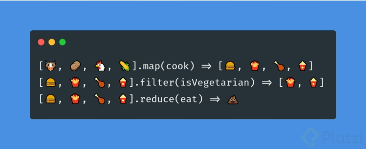

# 📒 V7 - Reduce

El método reduce() ejecuta una función reductora sobre cada elemento de un array, devolviendo como resultado un único valor.

```
    const array1 = [1, 2, 3, 4];

    // 0 + 1 + 2 + 3 + 4
    const initialValue = 0;
    const sumWithInitial = array1.reduce(
        (previousValue, currentValue) => previousValue + currentValue,
        initialValue
    );

    console.log(sumWithInitial);
    // expected output: 10

```
+ La función reductora recibe cuatro argumentos:
    1. Acumulador (acc)
    2. Valor Actual (cur)
    3. Índice Actual (idx)
    4. Array (src)

El valor devuelto de la función reductora se asigna al acumulador, cuyo valor se recuerda en cada iteración de la matriz y, en última instancia, se convierte en el valor final, único y resultante.

## Sintaxis

``` 
    arr.reduce(callback(acumulador, valorActual[, índice[, array]])[, valorInicial])
```

## Descripción

+ El método reduce() ejecuta callback una vez por cada elemento presente en el array, excluyendo los huecos del mismo, recibe cuatro argumentos:
    + valorAnterior
    + valorActual
    + indiceActual
    + array

La primera vez que se llama la función, valorAnterior y valorActual pueden tener uno de dos valores. Si se proveyó un valorInicial al llamar a reduce, entonces valorAnterior será igual al valorInicial y valorActual será igual al primer elemento del array. Si no se proveyó un valorInicial, entonces valorAnterior será igual al primer valor en el array y valorActual será el segundo.

Si el array está vacío y no se proveyó un valorInicial lanzará un TypeError (en-US). Si el array tiene un sólo elemento (sin importar la posición) y no se proveyó un valorInicial, o si se proveyó un valorInicial pero el arreglo está vacío, se retornará ese único valor sin llamar a la función.

Suponga que ocurre el siguiente uso de reduce:

```
    [0,1,2,3,4].reduce(function(valorAnterior, valorActual, indice, vector){
    return valorAnterior + valorActual;
    });

    // Primera llamada
    valorAnterior = 0, valorActual = 1, indice = 1

    // Segunda llamada
    valorAnterior = 1, valorActual = 2, indice = 2

    // Tercera llamada
    valorAnterior = 3, valorActual = 3, indice = 3

    // Cuarta llamada
    valorAnterior = 6, valorActual = 4, indice = 4

    // el array sobre el que se llama a reduce siempre es el objeto [0,1,2,3,4]

    // Valor Devuelto: 10
```
Y si proporcionas un valorInicial, el resultado sería como este:

```
    [0,1,2,3,4].reduce(function(valorAnterior, valorActual, indice, vector){
    return valorAnterior + valorActual;
    }, 10);

    // Primera llamada
    valorAnterior = 10, valorActual = 0, indice = 0

    // Segunda llamada
    valorAnterior = 10, valorActual = 1, indice = 1

    // Tercera llamada
    valorAnterior = 11, valorActual = 2, indice = 2

    // Cuarta llamada
    valorAnterior = 13, valorActual = 3, indice = 3

    // Quinta llamada
    valorAnterior = 16, valorActual = 4, indice = 4

    // el array sobre el que se llama a reduce siempre es el objeto [0,1,2,3,4]

    // Valor Devuelto: 20
```

## Ejemplos

+ Ejemplo: Sumar todos los valores de un array

```
    var total = [0, 1, 2, 3].reduce(function(a, b){ return a + b; });
    // total == 6

```

+ Ejemplo: Integrar un array a partir de varios arrays
```
    var integrado = [[0,1], [2,3], [4,5]].reduce(function(a,b) {
    return a.concat(b);
    });
    // integrado es [0, 1, 2, 3, 4, 5]
```

## Resumen

Este método REDUCE, efectivamente hace eso. Solo reduce a un solo valor y no devuelve otro array, simplemente un valor.

Se utiliza muchísimo para hacer cálculos a partir de la información de un array.

En su composición, a primeras, tiene como argumentos de la función del primer parámetro, al acumulador y como segundo parámetro al elemento por el que va iterando el loop. Y como segundo argumento del reduce(), se pasa el valor inicial del acumulador.

```
    const totals = [1,2,3,4];
    // primer argumento de la f() es el acumulador
    // segundo argumento de la f() es el elemento
    // segundo parámetro de la f() es el estado inicial del acumulador
    const rta = totals.reduce((sum, element) => sum + element, 0);
    console.log(rta)
```

+ Así funciona la iteración del reduce() por dentro:

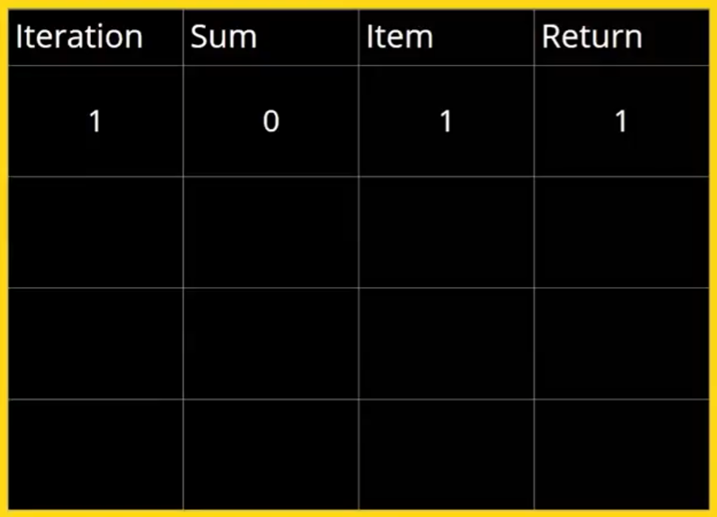

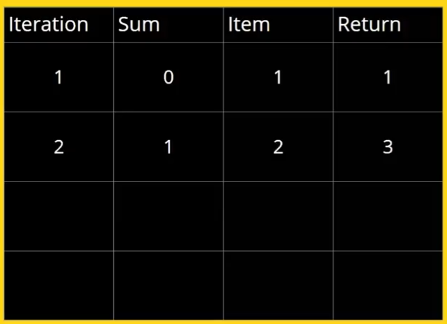

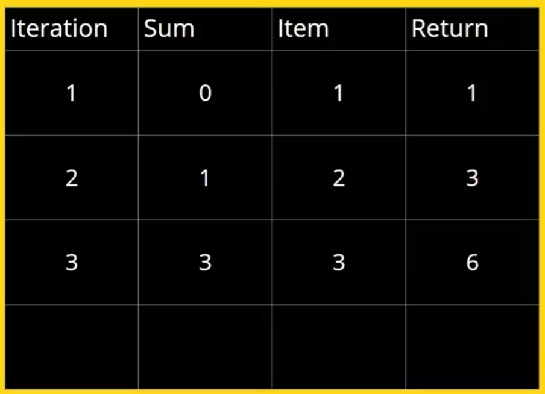

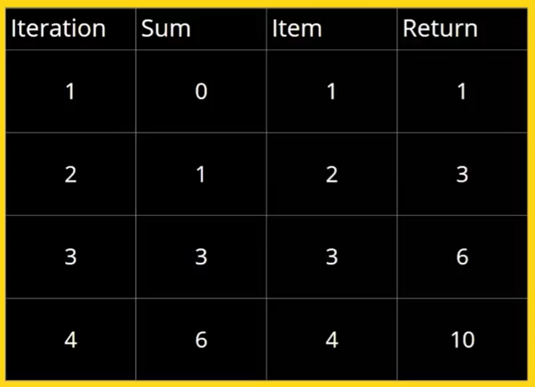


# 📒 V8 - Reduce Reloaded

Veremos las iteraciones en imagenes del siguiente codigo:
```
    /Contaremos el numero de veces que se repiten los numero dentro del array items
    //1 --> se repite una vez
    //3 --> se repite dos veces
    //2 -- se repite una vez
    const items = [1, 3, 2, 3];

    //funcion reduce
    // primer argumento de la f() es el acumulador
    // segundo argumento de la f() es el elemento y es el estado inicial del acumulador
    const rta = items.reduce((obj, item) => {
        //Si dentro no existe el numero, inicializamos el acumulador a uno
        if (!obj[item]) {
            obj[item] = 1;
        } else {//si no, existe y sumamos uno en el acumulador
            obj[item] = obj[item] + 1;
        }
        return obj;
    }, {});

    console.log(rta);
```
+ Salida:

```
    { '1': 1, '2': 1, '3': 2 }
```

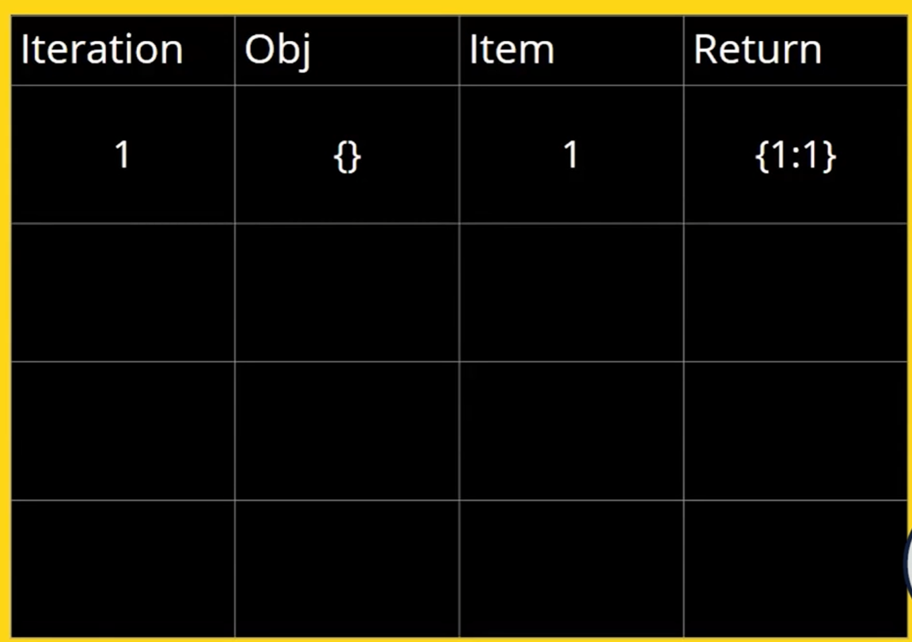

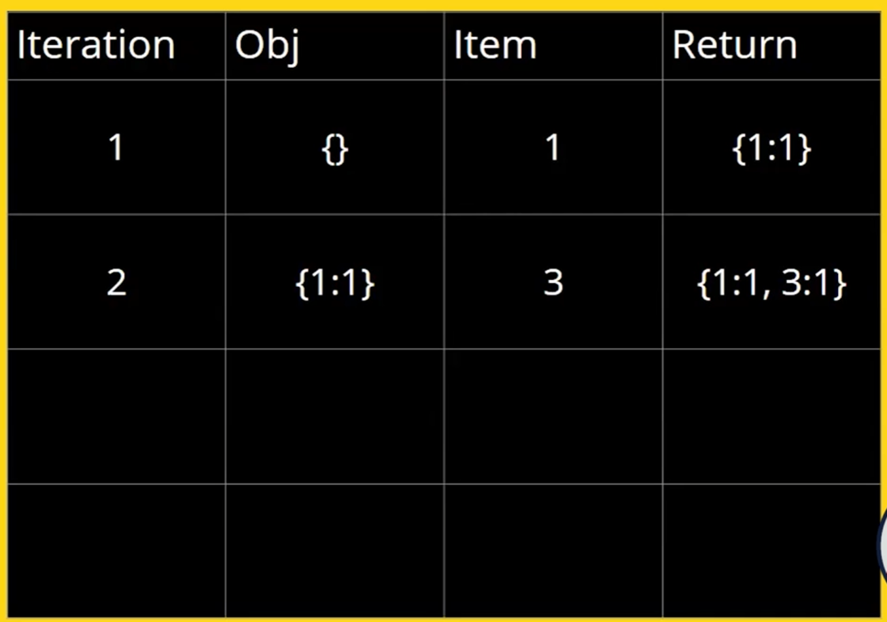


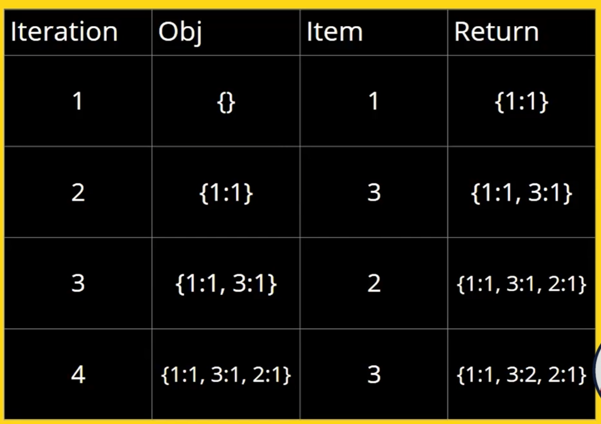

## ¿No entiendo el obj[item]?

Este formato nos permite acceder al valor que tiene una propiedad de un objeto. obj es el objeto acumulador, item es la key del objeto y obj[item] es el value de item en obj

# 📒 v9 - Some

El método some() comprueba si al menos un elemento del array cumple con la condición implementada por la función proporcionada.
+ Nota: Este método devuelve false para cualquier condición puesta en un array vacío.

## Sintaxis

arr.some(callback(element[, index[, array]])[, thisArg])

Resumen

Este método nos devuelve true o false sí al menos 1 elemento de nuestro array cumple con la condición.

```
    const array = [1, 2, 3, 4, 5];

    const even = (element) => element % 2 === 0;

    console.log(array.some(even));
    // resultado true

```

## ¿tengo que instalar la libreria en el directorio del proyecto o en el home?

debes instalar esta librería en el directorio del proyecto, con esto ya debería funcionarte.

# 📒 V10 - Every

Determina si todos los elementos en el array satisfacen una condición.
+ Precaución: ¡Llamar este método en un array vacío devuelve true para cualquier condición!
```
    const isBelowThreshold = (currentValue) => currentValue < 40;

    const array1 = [1, 30, 39, 29, 10, 13];

    console.log(array1.every(isBelowThreshold));
    // expected output: true

```

## Sintaxis

```
    arr.every(callback(element[, index[, array]])[, thisArg])
```

# 📒 v11 - Find y Finder

El método find() devuelve el valor del primer elemento del array que cumple la función de prueba proporcionada.

```
    const array1 = [5, 12, 8, 130, 44];

    const found = array1.find(element => element > 10);

    console.log(found);
    // expected output: 12
```

+ Si necesitas el índice del elemento encontrado en el array, utiliza findIndex().
+ Si necesitas encontrar el índice de un elemento, Array.prototype.indexOf(). (Es similar a findIndex(), pero comprueba la igualdad de cada elemento con el valor en lugar de usar una función de prueba.)
+ Si necesitas encontrar si un valor existe en un array, utiliza Array.prototype.includes().
+ Si necesitas encontrar si algún elemento cumple la función de prueba proporcionada, usa Array.prototype.some().

## Sintaxis

```
    arr.find(callback(element[, index[, array]])[, thisArg])
```

# 📒 v12 - Includes

El método includes() determina si una array incluye un determinado elemento, devuelve true o false según corresponda.

```
    const array1 = [1, 2, 3];

    console.log(array1.includes(2));
    // expected output: true

    const pets = ['cat', 'dog', 'bat'];

    console.log(pets.includes('cat'));
    // expected output: true

    console.log(pets.includes('at'));
    // expected output: false
```

También posee un segundo parámetro que es el fromIndex, que es la posición donde comenzar a buscar el valor en el array.

```
    [1, 2, 3].includes(2);     // true
    [1, 2, 3].includes(4);     // false
    [1, 2, 3].includes(3, 3);  // false
    [1, 2, 3].includes(3, -1); // true
    [1, 2, NaN].includes(NaN); // true
```

Este fromIndex sí es igual o mayor que el tamaño del array, devuelve false automaticamente sin buscar en el vector. Sí el fromIndex es negativo busca en todo el array. Y para los casos 0, -0, +0 lo toma como cero y también lee todo el array.

# 📒 v13 - Join

El método join() une todos los elementos de un array en una cadena y devuelve esta cadena. Podemos pasarle cualquier elemento como separador que deseemos.

```
    const elements = ['Fire', 'Air', 'Water'];

    console.log( elements.join() );
    // expected output "Fire,Air,Water"

    console.log(elements.join(''));
    // expected output "FireAirWater"

    console.log(elements.join('-'));
    // expected output "Fire-Air-Water"
```

Y el método split() divide un objeto de tipo String en un array de cadenas mediante la separación de la cadena en sub-cadenas. Acá esta muy bien explicado y con muchos ejemplos:

```
function dividirCadena(cadenaADividir,separador) {
   var arrayDeCadenas = cadenaADividir.split(separador);
   document.write('<p>La cadena original es: "' + cadenaADividir + '"');
   document.write('<br>El separador es: "' + separador + '"');
   document.write("<br>El array tiene " + arrayDeCadenas.length + " elementos: ");

   for (var i=0; i < arrayDeCadenas.length; i++) {
      document.write(arrayDeCadenas[i] + " / ");
   }
}

    var cadenaVerso = "Oh brave new world that has such people in it.";
    var cadenaMeses = "Jan,Feb,Mar,Apr,May,Jun,Jul,Aug,Sep,Oct,Nov,Dec";

    var espacio = " ";
    var coma = ",";

    dividirCadena(cadenaVerso, espacio);
    dividirCadena(cadenaVerso);
    dividirCadena(cadenaMeses, coma);
```

Output:

```
    La cadena original es: "Oh brave new world that has such people in it."
    El separador es: " "
    El array tiene 10 elementos: Oh / brave / new / world / that / has / such / people / in / it. /

    La cadena original es: "Oh brave new world that has such people in it."
    El separador es: "undefined"
    El array tiene 1 elementos: Oh brave new world that has such people in it. /

    La cadena original es: "Jan,Feb,Mar,Apr,May,Jun,Jul,Aug,Sep,Oct,Nov,Dec"
    El separador es: ","
    El array tiene 12 elementos: Jan / Feb / Mar / Apr / May / Jun / Jul / Aug / Sep / Oct / Nov / Dec /
```

# 📒 v14 - Concat

El método concat() se usa para unir dos o más arrays. Este método no cambia los arrays existentes, sino que devuelve un nuevo array. 

Recordar que al ser inmutable, los arrays (tanto el nuevo como el viejo) quedaran referenciados por memoria, por lo tanto sí modificamos alguno de los dos, los cambios se verán reflejados en ambos.

```
    const array1 = ['a', 'b', 'c'];
    const array2 = ['d', 'e', 'f'];
    const array3 = array1.concat(array2);

    console.log(array3);
    // expected output: Array ["a", "b", "c", "d", "e", "f"]

```

El método slice() devuelve una copia de una parte del array dentro de un nuevo array empezando por inicio hasta fin (fin no incluido). El array original no se modificará.

```
    const animals = ['ant', 'bison', 'camel', 'duck', 'elephant'];

    console.log(animals.slice(2));
    // expected output: Array ["camel", "duck", "elephant"]

    console.log(animals.slice(2, 4));
    // expected output: Array ["camel", "duck"]

    console.log(animals.slice(1, 5));
    // expected output: Array ["bison", "camel", "duck", "elephant"]

    console.log(animals.slice(-2));
    // expected output: Array ["duck", "elephant"]

    console.log(animals.slice(2, -1));
    // expected output: Array ["camel", "duck"]
```

# 📒 v15 -Flat

El método flat() crea una nueva matriz con todos los elementos de sub-array concatenados recursivamente hasta la profundidad especificada.
La funcionalidad de Flat con recursión: Se busca recursivamente en cada elemento hasta que ya no se encuentre otra lista y se van uniendo los elementos encontrados con Cat.

```
    var arr1 = [1, 2, [3, 4]];
    arr1.flat();
    // [1, 2, 3, 4]

    var arr2 = [1, 2, [3, 4, [5, 6]]];
    arr2.flat();
    // [1, 2, 3, 4, [5, 6]]

    var arr3 = [1, 2, [3, 4, [5, 6]]];
    arr3.flat(2);
    // [1, 2, 3, 4, 5, 6]
```

El algoritmo sin utilizar flat

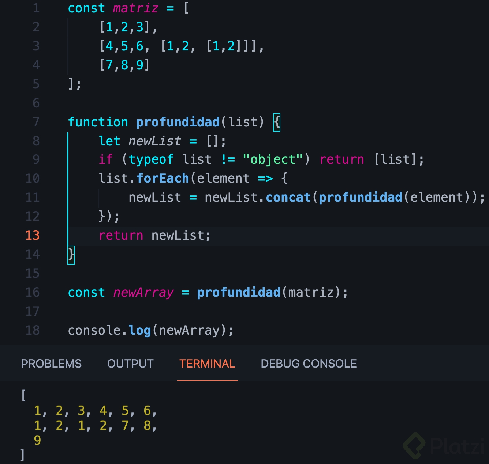


# 📒 v16 - FlatMap

El método flatMap() primero mapea cada elemento usando una función de mapeo, luego aplana el resultado en una nueva matriz. Es idéntico a un map seguido de un flatten (en-US)de profundidad 1, pero flatMap es a menudo útil y la fusión de ambos en un método es ligeramente más eficiente.

## Valor de retorno

Una nueva matriz con cada elemento es el resultado de la función de devolución de llamada y se aplana a una profundidad de 1.

```
    var arr1 = [1, 2, 3, 4];

    arr1.map(x => [x * 2]);
    // [[2], [4], [6], [8]]

    arr1.flatMap(x => [x * 2]);
    // [2, 4, 6, 8]

    // solo un nivel es aplanado
    arr1.flatMap(x => [[x * 2]]);
    // [[2], [4], [6], [8]]
```

## Alternativa

### reduce y concat

```
    var arr1 = [1, 2, 3, 4];

    arr1.flatMap(x => [x * 2]);
    // es equivalente a
    
    arr1.reduce((acc, x) => acc.concat([x * 2]), []);
    // [2, 4, 6, 8]
```

# 📒 v17 - Mutable functions

Aquí veremos algunos metodos mutables:

```
    const products = [
        { title: "Pizza", price: 121, id: "🍕" },
        { title: "Burger", price: 121, id: "🍔" },
        { title: "Hot cakes", price: 121, id: "🥞" },
    ];

    const myProducts = [];
    console.log("products", products);
    console.log("myProducts", myProducts);
    console.log("-".repeat(10));
    
    const productIndex = products.findIndex(item => item.id === '🍔');
    if (productIndex !== -1) {
        myProducts.push(products[productIndex]);
        products.splice(productIndex, 1);
    }
    console.log("products", products);
    console.log("myProducts", myProducts);
    console.log("-".repeat(10));
    
    // Update
    
    const productsV2 = [
        { title: "Pizza", price: 121, id: "🍕" },
        { title: "Burger", price: 121, id: "🍔" },
        { title: "Hot cakes", price: 121, id: "🥞" },
        ];
    const update = {
        id: "🥞",
        changes: {
            price: 200,
            description: 'delicioso'
        }
    }
    const productIndexV2 = productsV2.findIndex(item => item.id === update.id);
    productsV2[productIndexV2] = {
        ...productsV2[productIndexV2],
        ...update.changes,
    };
    console.log(productsV2);
```

# 📒 v18 - Sort

El método sort() ordena los elementos de un arreglo (array) localmente y devuelve el arreglo ordenado. La ordenación no es necesariamente estable. El modo de ordenación por defecto responde a la posición del valor del string de acuerdo a su valor Unicode.

## Sintaxis

```
    arr.sort([compareFunction])
```

## Descripción

Si no se provee compareFunction, los elementos son ordenados convirtiéndolos a strings y comparando la posición del valor Unicode de dichos strings. Por ejemplo, "Cherry" viene antes que "banana"  (porque las mayúsculas van antes que las minúsculas en la codificación Unicode) . En un ordenamiento numérico, 9 está antes que 80, pero dado que los números son convertidos a strings y ordenados según el valor Unicode, el resultado será "80" antes que "9".

```
    var frutas = ['guindas', 'manzanas', 'bananas'];
    frutas.sort(); // ['bananas', 'guindas', 'manzanas']

    var puntos = [1, 10, 2, 21];
    puntos.sort(); // [1, 10, 2, 21]
    // Tenga en cuenta que 10 viene antes que 2
    // porque '10' viene antes que '2' según la posición del valor Unicode.

    var cosas = ['word', 'Word', '1 Word', '2 Words'];
    cosas.sort(); // ['1 Word', '2 Words', 'Word', 'word']
    // En Unicode, los números vienen antes que las letras mayúsculas
    // y estas vienen antes que las letras minúsculas.
```

+ Si se provee compareFunction, los elementos del array son ordenados de acuerdo al valor que retorna dicha función de comparación. Siendo a y b dos elementos comparados, entonces:
    + Si compareFunction(a, b) es menor que 0, se sitúa a en un indice menor que b. Es decir, a viene primero.
    + Si compareFunction(a, b) retorna 0, se deja a y b sin cambios entre ellos, pero ordenados con respecto a todos los elementos diferentes. Nota: el estandar ECMAscript no garantiza este comportamiento, por esto no todos los navegadores (p.ej.  Mozilla en versiones que datan hasta el 2003) respetan esto.
    + Si compareFunction(a, b) es mayor que 0, se sitúa b en un indice menor que a.
    + compareFunction(a, b) siempre debe retornar el mismo valor dado un par especifico de elementos a y b como sus argumentos. Si se retornan resultados inconsistentes entonces el orden de ordenamiento es indefinido.

## Entonces, la función de comparación tiene la siguiente forma:

```
    function compare(a, b) {
    if (a es menor que b según criterio de ordenamiento) {
        return -1;
    }
    if (a es mayor que b según criterio de ordenamiento) {
        return 1;
    }
    // a debe ser igual b
    return 0;
    }
```

Para comparar números en lugar de strings, la función de comparación puede simplemente restar b de a. La siguiente función ordena el array de modo ascendente:

```
    function compareNumbers(a, b) {
    return a - b;
    }
```

El metodo sort puede ser usado convenientemente con function expressions (y closures):

```
    var numbers = [4, 2, 5, 1, 3];
    numbers.sort(function(a, b) {
    return a - b;
    });
    console.log(numbers);


    // [1, 2, 3, 4, 5]
```
Los objectos pueden ser ordenados por el valor de una de sus propiedades.

```
    var items = [
    { name: 'Edward', value: 21 },
    { name: 'Sharpe', value: 37 },
    { name: 'And', value: 45 },
    { name: 'The', value: -12 },
    { name: 'Magnetic', value: 13 },
    { name: 'Zeros', value: 37 }
    ];
    items.sort(function (a, b) {
    if (a.name > b.name) {
        return 1;
    }
    if (a.name < b.name) {
        return -1;
    }
    // a must be equal to b
    return 0;
    });
```

## Ejemplos

### Ordenando un array

Un array de elementos string, sin especificar una función de comparación:

```
    var arr = [ 'a', 'b', 'Z', 'Aa', 'AA' ];
    arr.sort();  //[ 'AA', 'Aa', 'Z', 'a', 'b' ]
```

Un array de elementos numéricos,  sin función de comparación:

```
    var arr = [ 40, 1, 5, 200 ];
    arr.sort();  //[ 1, 200, 40, 5 ]
```

Un array de elementos numéricos, usando una función de comparación:

```
    var arr = [ 40, 1, 5, 200 ];
    function comparar ( a, b ){ return a - b; }
    arr.sort( comparar );  // [ 1, 5, 40, 200 ]
```

Lo mismo pero usando una función anónima normal:

```
    var arr = [ 40, 1, 5, 200 ];
    arr.sort(function(a,b){return a - b;});  // [ 1, 5, 40, 200 ]
```

Lo mismo escrito más compacto mediante una función flecha:

```
    var arr = [ 40, 1, 5, 200 ];
    arr.sort((a,b)=>a-b);  // [ 1, 5, 40, 200 ]
```

## Preguntas y Respuestas

### 1. ¿El método forEach es el recomendado para filtrar elementos de un array?

Falso.

### 2. ¿Por qué el siguiente código cambia el estado original del array?
```
    const array = [{age: 1}, {age:2}]; 
    const rta = array.map(item => {   
    item.name = 'My name';
    return item; 
    })
```

Porque al trabajar con objetos se está modificando la referencia en memoria.

### 3. ¿Filter es un método que cambia el estado original de un array?

Falso.

### 4. ¿Cuál es el resultado del siguiente código?

```
    const array = ['a', 'bb', 'ccc']; 
    const rta = array.map(item => item.length);
```
[ 1, 2, 3 ]

### 5. Si quiero obtener la suma de todos los valores de este array [1,1,1,1,1], ¿cuál es el código que lo va a resolver?

Respuesta:
```
    const array = [1,1,1,1,1]; 
    const rta = array.reduce((total, item) => total + item, 0)
```

### 6. ¿Reduce() es un método que NO cambia el estado original de un array?

Verdadero.

### 7. ¿Cuál de estos métodos me retorna un true si alguno de los elementos del array tiene este emoji 🐸?

Respuesta:
```
    const array = ['🐸','🐱','🐹']; 
    const rta = array.some(item => item === '🐸')
```
### 8. ¿Cuál de estos métodos me retorna la posición del array en donde está el emoji 🐸?

```
    const array = ['🐸','🐱','🐹']; 
    const rta = array.findIndex(item => item === '🐸'); 
```
### 9. ¿Cuál es el resultado del siguiente código?

```
    const array = [['🐸','🐱'],'🐹', ['🐯']]; 
    const rta = array.flat();
```
Respuesta:
[ '🐸', '🐱', '🐹', '🐯' ]

### 10. ¿Sort es un método que cambia el estado original de un array?

Verdadero

### 11. ¿Cuál es una forma de copiar los elementos de un array sin tener problemas de mutabilidad?
```
    const listA = [1,2,2,4]; 
    const newList = [...listA];
```
### 12. ¿Cuál de los siguientes códigos ordena este array [11,1,13,99,8] de menor a mayor?
```
    const array = [11,1,13,99,8]; 
    array.sort((a,b) => a - b);
```